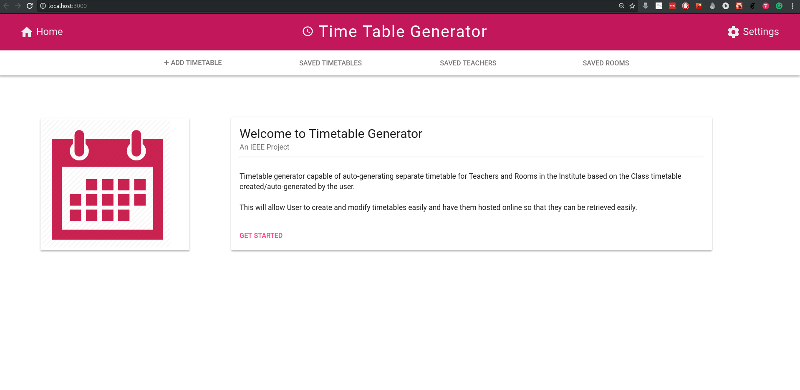
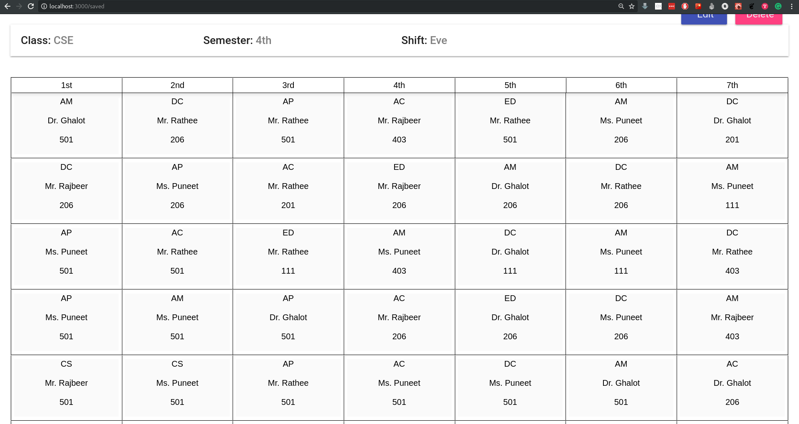

# Time-Table Generator

[](https://github.com/vigzmv/timetable-generator)
&nbsp;&nbsp;
[](https://github.com/vigzmv/timetable-generator)
&nbsp;&nbsp;
[](https://github.com/vigzmv/timetable-generator)

Auto timetable generator from list of Teachers, Classes and rooms.

Built Using:

* React
* React-router
* Firebase
* re-base
* Material Ui

## Live Demo

Check out the live demo
[Here: https://vigneshm.com/timetable-generator/](https://vigneshm.com/timetable-generator/)

<hr>

## Screenshots

 

<hr>

## Run the App

### Install the dependencies:

```sh
yarn install || npm install
```

### Run the development server:

```sh
yarn start || npm start
```

Runs the app in the development mode.<br> Open
[http://localhost:3000](http://localhost:3000) to view it in the browser.

The page will reload if you make edits.<br> You will also see any lint errors in
the console.

### Build the app for production:

```sh
yarn build || npm build
```

Builds the app for production to the `docs` folder.<br> It correctly bundles
React in production mode and optimizes the build for the best performance.

The build is minified and the filenames include the hashes.<br> App is
ready to be deployed!

<hr>

## Contribute ?

* Fork the repository
* Commit your changes
* Submit a pull request

## Licence

[MIT Licence](https://github.com/vigzmv/what_the_thing/blob/master/LICENSE) ©
[Vignesh M](https://vigneshm.com)
